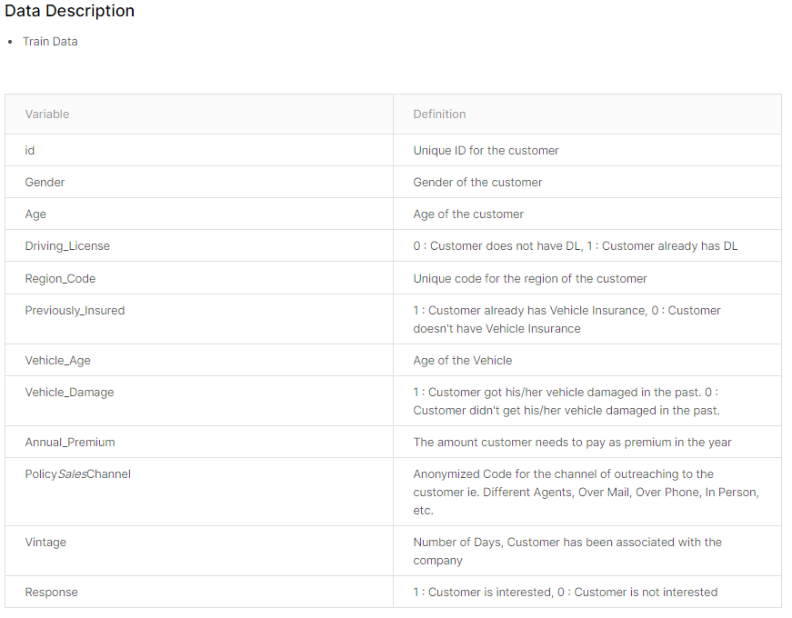

# Health Insurance Cross Sell Prediction

Predict Health Insurance Owners' who will be interested in Vehicle Insurance

> 数据挖掘kaggle：https://www.kaggle.com/datasets/anmolkumar/health-insurance-cross-sell-prediction

## 题目背景：

这是一家为客户提供健康保险的保险公司，现在他们需要你的帮助来建立一个模型来预测过去一年的投保人（客户）是否也会对公司提供的汽车宝贤感兴趣。

## 分析目标

通过已投健康保险的客户的个人以及车辆信息，来预测该客户是否对公司提供的汽车保险感兴趣。

### 数据情况：

训练集：304888条

测试集：76221条

### 评价指标

AUC，ROC曲线下的面积

### 思路

1. 数据分析——对原始数据进行分析
   1. 数据结构分析
   2. 缺失值分析
   3. 离散值分析
   4. 连续值分析
   5. 变量比较分析
2. 数据预处理
   1. 缺失值处理
   2. 连续值异常值处理
   3. one_hot离散化
   4. 连续值标准化
   5. 平衡样本数据
3. 分类器设计
   1. 设计多个分类器
   2. 集成学习比较
   3. 评估指标AUC，metric_score，画图
   4. 划分数据集train, valid, test
4. 验证集调整参数
5. 输出测试集结果